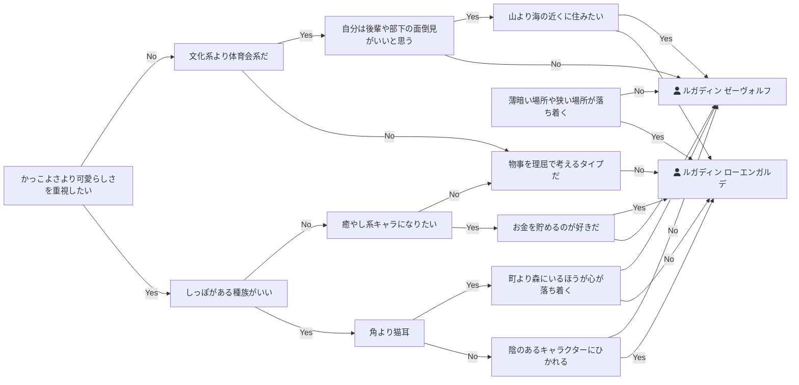

```mermaid
    graph LR;
        see[fa:fa-user ルガディン ゼーヴォルフ]
        loh[fa:fa-user ルガディン ローエンガルデ]
        かっこよさより可愛らしさを重視したい--> |No| 文化系より体育会系だ;
        文化系より体育会系だ--> |Yes| 自分は後輩や部下の面倒見がいいと思う;
        自分は後輩や部下の面倒見がいいと思う--> |Yes| 山より海の近くに住みたい;
        山より海の近くに住みたい--> |Yes| see;
        山より海の近くに住みたい--> |No| loh;
        自分は後輩や部下の面倒見がいいと思う--> |No| see;
        文化系より体育会系だ--> |No| 物事を理屈で考えるタイプだ;
        物事を理屈で考えるタイプだ--> |No| loh;
        薄暗い場所や狭い場所が落ち着く--> |No| see;
        薄暗い場所や狭い場所が落ち着く--> |Yes| loh;
        かっこよさより可愛らしさを重視したい--> |Yes| しっぽがある種族がいい;
        しっぽがある種族がいい--> |No| 癒やし系キャラになりたい;
        癒やし系キャラになりたい--> |No| 物事を理屈で考えるタイプだ;
        癒やし系キャラになりたい--> |Yes| お金を貯めるのが好きだ;
        お金を貯めるのが好きだ--> |Yes| loh;
        お金を貯めるのが好きだ--> |No| see;
        しっぽがある種族がいい--> |Yes| 角より猫耳;
        角より猫耳--> |Yes| 町より森にいるほうが心が落ち着く;
        町より森にいるほうが心が落ち着く--> |Yes| see;
        町より森にいるほうが心が落ち着く--> |No| loh;
        角より猫耳--> |No| 陰のあるキャラクターにひかれる;
        陰のあるキャラクターにひかれる--> |No| see;
        陰のあるキャラクターにひかれる--> |Yes| loh;
```